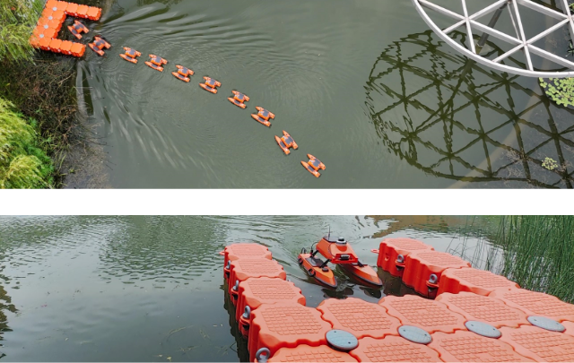

# LLM4SAC
---
Autonomous docking task in a real-world scenario. The USV begins from the pre-docking zone and autonomously maneuvers towards the docker
<!-- 这是一个空行，保持段落分隔 -->

<!-- 这是一个空行，保持段落分隔 -->
---
## Real-World Experiment Results 

We conducted 20 real-world experiments using our algorithm, achieving 16 successes and 4 failures. Below, you can see a visual demonstration of both the successful and failed experiments.

<table> <tr> <!-- 第一行，成功实验的 GIF --> <td align="center">   <strong>Success Video</strong> </td> </tr> <tr> <!-- 第二行，失败实验的 GIF --> <td align="center">   <strong>Failed Video</strong> </td> </tr> </table>
